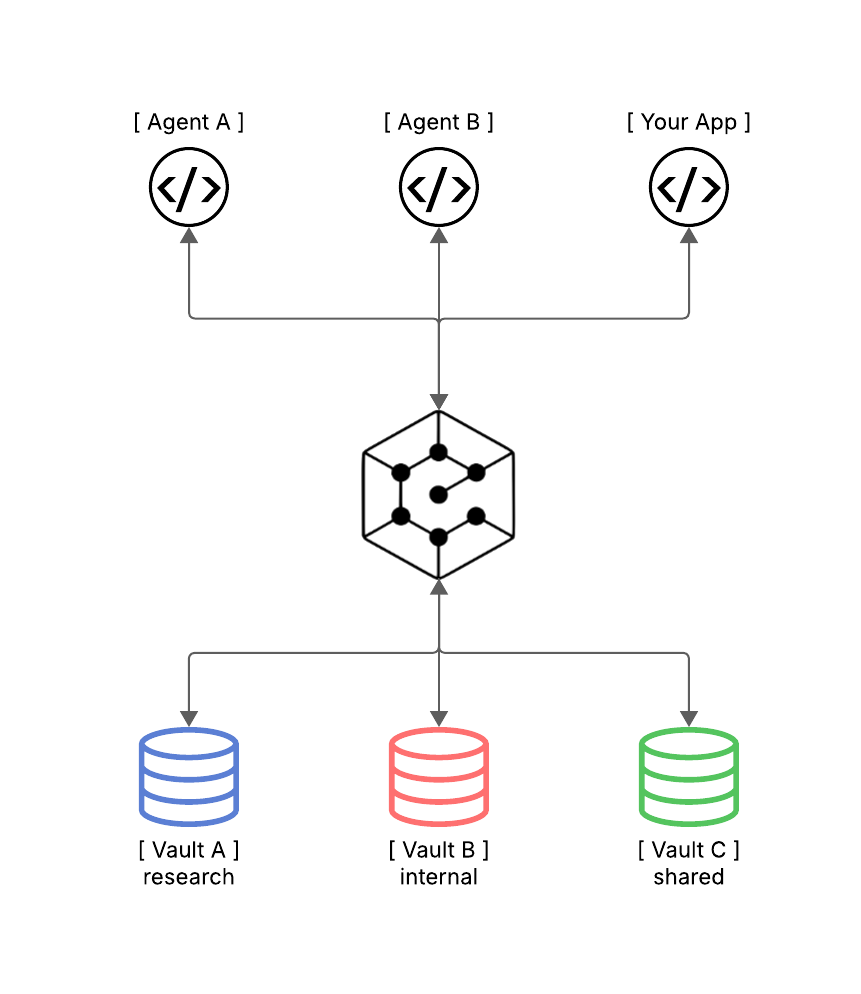

<div align="center">
<picture>
    <source media="(prefers-color-scheme: dark)" srcset="https://raw.githubusercontent.com/Filippo-Venturini/ctxvault/main/assets/logo_white_text.svg" width="400" height="100">
    <source media="(prefers-color-scheme: light)" srcset="https://raw.githubusercontent.com/Filippo-Venturini/ctxvault/main/assets/logo_black_text.svg" width="400" height="100">
    
</picture>

<h3>Semantic knowledge vault for AI agents and RAG pipelines</h3>
<p><i>Local-first semantic memory you control. No cloud, no complexity.</i></p>

[](https://opensource.org/licenses/MIT)
[](https://pypi.org/project/ctxvault/)


[Installation](#installation) • [Quick Start](#quick-start) • [Examples](#examples) • [Documentation](#documentation) • [API Reference](#api-reference)

</div>

---

## What is CtxVault?

CtxVault is a **local semantic memory layer** for LLM applications. Index documents, let agents write context, and query everything semantically — all running on your machine, with zero cloud dependencies.

<div align="center">
  <picture>
    <source media="(prefers-color-scheme: dark)" srcset="assets/architectural_schema_dark.png">
    
  </picture>
</div>

**100% Local** — No API keys, no cloud services, no telemetry. Your data never leaves your machine.

**Multi-Vault Architecture** — Run isolated vaults for different contexts. Separate personal notes from company docs, or give each agent its own knowledge domain.

**Agent-Ready** — Built-in FastAPI server for seamless integration with LangChain, LangGraph, and custom agent workflows. Write and query memory programmatically.

**Developer-First** — Simple CLI for manual use. HTTP API for programmatic integration. No configuration overhead.

---

## Installation

**Requirements:** Python 3.10+

### From PyPI
```bash
pip install ctxvault
```

### From source
```bash
git clone https://github.com/Filippo-Venturini/ctxvault
cd ctxvault
python -m venv .venv && source .venv/bin/activate  # Windows: .venv\Scripts\activate
pip install -e .
```

---

## Quick Start

Both CLI and API follow the same workflow: create a vault → add documents → index → query. Choose CLI for manual use, API for programmatic integration.

### CLI Usage

```bash
# 1. Initialize a vault
ctxvault init my-vault

# 2. Add your documents to the vault folder
# Default location: ~/.ctxvault/vaults/my-vault/
# Drop your .txt, .md, .pdf or .docx files there

# 3. Index documents
ctxvault index my-vault

# 4. Query semantically
ctxvault query my-vault "transformer architecture"

# 5. List indexed documents
ctxvault list my-vault

# 6. List all your vaults
ctxvault vaults
```

### Agent Integration

Give your agent **persistent semantic memory** in minutes. Start the server:
```bash
uvicorn ctxvault.api.app:app
```
Then write, store, and recall context across sessions:
```python
import requests
from langchain_openai import ChatOpenAI

API = "http://127.0.0.1:8000/ctxvault"

# 1. Create a vault
requests.post(f"{API}/init", json={"vault_name": "agent-memory"})

# 2. Agent writes what it learns to memory
requests.post(f"{API}/write", json={
    "vault_name": "agent-memory",
    "filename": "session_monday.md",
    "content": "Discussed Q2 budget: need to cut cloud costs by 15%. "
               "Competitor pricing is 20% lower than ours."
})

# 3. Days later — query with completely different words
results = requests.post(f"{API}/query", json={
    "vault_name": "agent-memory",
    "query": "financial constraints from last week",  # ← never mentioned in the doc
    "top_k": 3
}).json()["results"]

# 4. Ground your LLM in retrieved memory
context = "\n".join(r["text"] for r in results)
answer = ChatOpenAI().invoke(f"Context:\n{context}\n\nQ: What are our cost targets?")
print(answer.content)
# → "You mentioned a 15% cloud cost reduction target, with competitor pricing 20% lower."
```
> **Any LLM works** — swap `ChatOpenAI` for Ollama, Anthropic, or any provider.
> Ready to go further? See the [examples](#examples) for full RAG pipelines and multi-agent architectures — or browse the [API Reference](#api-reference) and the interactive docs at `http://127.0.0.1:8000/docs`.

---

## Examples

Three production-ready scenarios — each with full code and setup instructions.

| | Example | What it shows |
|--|---------|---------------|
| 🟢 | [**01 · Personal Research Assistant**](examples/01-simple-rag/) | Semantic RAG over PDF, MD, TXT, DOCX. Ask questions, get cited answers. ~100 lines. |
| 🔴 | [**02 · Multi-Agent Isolation**](examples/02-multi-agent-isolation/) | Two agents, two vaults, one router. The public agent *cannot* access internal docs — privacy enforced at the knowledge layer. ~200 lines. |
| 🔵 | [**03 · Persistent Memory Agent**](examples/03-persistent-memory/) | Agent that recalls context across sessions with fuzzy semantic queries. "financial constraints" finds "cost cuts" from 3 days ago. |

---

## CtxVault vs Alternatives

| Feature | CtxVault | Pinecone/Weaviate | LangChain VectorStores | Mem0/Zep |
|---------|----------|-------------------|------------------------|----------|
| **Local-first** | ✓ | ✗ (cloud) | ✓ | ✗ (cloud APIs) |
| **Multi-vault** | ✓ | ✗ | ✗ | Partial |
| **CLI + API** | ✓ | API only | Code only | API only |
| **Zero config** | ✓ | ✗ (setup required) | ✗ (code integration) | ✗ (external service) |
| **Agent write support** | ✓ | ✓ | ✗ | ✓ |
| **Privacy** | 100% local | Cloud | Depends on backend | Cloud |

**When to use CtxVault:**
- You need local-first semantic search
- Multiple isolated knowledge contexts
- Simple setup without external services
- Integration with LangChain/LangGraph workflows

**When to use alternatives:**
- Cloud-native architecture required
- Already invested in specific cloud ecosystem

---

## Documentation

### CLI Commands

All commands require a vault name. Default vault location: `~/.ctxvault/vaults/<name>/`

---

#### `init`
Initialize a new vault.
```bash
ctxvault init <name> [--path <path>]
```

**Arguments:**
- `<name>` - Vault name (required)
- `--path <path>` - Custom vault location (optional, default: `~/.ctxvault/vaults/<name>`)

**Example:**
```bash
ctxvault init my-vault
ctxvault init my-vault --path /data/vaults
```

---

#### `index`
Index documents in vault.
```bash
ctxvault index <vault> [--path <path>]
```

**Arguments:**
- `<vault>` - Vault name (required)
- `--path <path>` - Specific file or directory to index (optional, default: entire vault)

**Example:**
```bash
ctxvault index my-vault
ctxvault index my-vault --path docs/papers/
```

---

#### `query`
Perform semantic search.
```bash
ctxvault query <vault> <text>
```

**Arguments:**
- `<vault>` - Vault name (required)
- `<text>` - Search query (required)

**Example:**
```bash
ctxvault query my-vault "attention mechanisms"
```

---

#### `list`
List all indexed documents in vault.
```bash
ctxvault list <vault>
```

**Arguments:**
- `<vault>` - Vault name (required)

**Example:**
```bash
ctxvault list my-vault
```

---

#### `delete`
Remove document from vault.
```bash
ctxvault delete <vault> --path <path>
```

**Arguments:**
- `<vault>` - Vault name (required)
- `--path <path>` - File path to delete (required)

**Example:**
```bash
ctxvault delete my-vault --path paper.pdf
```

---

#### `reindex`
Re-index documents in vault.
```bash
ctxvault reindex <vault> [--path <path>]
```

**Arguments:**
- `<vault>` - Vault name (required)
- `--path <path>` - Specific file or directory to re-index (optional, default: entire vault)

**Example:**
```bash
ctxvault reindex my-vault
ctxvault reindex my-vault --path docs/
```

---

#### `vaults`
List all vaults and their paths.
```bash
ctxvault vaults
```

**Example:**
```bash
ctxvault vaults
```

---

**Vault management:**
- Default location: `~/.ctxvault/vaults/<vault-name>/`
- Vault registry: `~/.ctxvault/config.json` tracks all vault names and their paths
- Custom paths: Use `--path` flag during `init` to create vault at custom location
- All other commands use vault name (path lookup via config.json)

**Multi-vault support:**
```bash
# Work with specific vault
ctxvault research query "topic"

# Default vault location: ~/.ctxvault/vaults/
# Override with --path for custom locations
```

---

### API Reference

**Base URL:** `http://127.0.0.1:8000/ctxvault`

| Endpoint | Method | Description |
|----------|--------|-------------|
| `/init` | POST | Initialize vault |
| `/index` | PUT | Index entire vault or specific path |
| `/query` | POST | Semantic search |
| `/write` | POST | Write and index new file |
| `/docs` | GET | List indexed documents |
| `/delete` | DELETE | Remove document from vault |
| `/reindex` | PUT | Re-index entire vault or specific path |
| `/vaults` | GET | List all the initialized vaults |

**Interactive documentation:** Start the server and visit `http://127.0.0.1:8000/docs`

---

## Roadmap

- [x] CLI MVP
- [x] FastAPI server
- [x] Multi-vault support
- [x] Agent write API
- [ ] File watcher / auto-sync
- [ ] Hybrid search (semantic + keyword)
- [ ] MCP server support
- [ ] Configurable embedding models

---

## Contributing

Contributions welcome! Please check the [issues](https://github.com/Filippo-Venturini/ctxvault/issues) for open tasks.

**Development setup:**
```bash
git clone https://github.com/Filippo-Venturini/ctxvault
cd ctxvault
python -m venv .venv && source .venv/bin/activate  # Windows: .venv\Scripts\activate
pip install -e ".[dev]"
pytest
```

---

## Citation

If you use CtxVault in your research or project, please cite:
```bibtex
@software{ctxvault2026,
  author = {Filippo Venturini},
  title = {CtxVault: Local Semantic Knowledge Vault for AI Agents},
  year = {2026},
  url = {https://github.com/Filippo-Venturini/ctxvault}
}
```

---

## License

MIT License - see [LICENSE](LICENSE) for details.

---

## Acknowledgments

Built with [ChromaDB](https://www.trychroma.com/), [LangChain](https://www.langchain.com/) and [FastAPI](https://fastapi.tiangolo.com/).

---

<div align="center">
<sub>Made by <a href="https://github.com/Filippo-Venturini">Filippo Venturini</a> · <a href="https://github.com/Filippo-Venturini/ctxvault/issues">Report an issue</a> · ⭐ Star if useful</sub>
</div>
